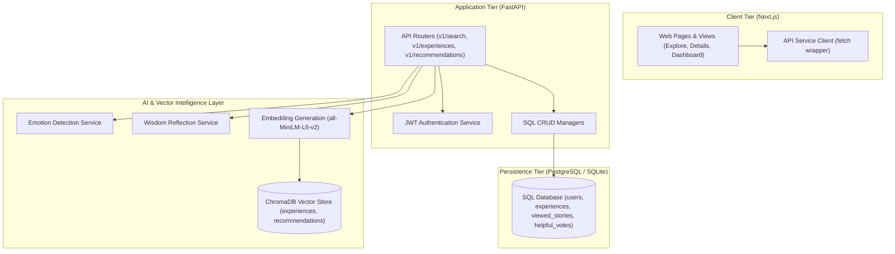
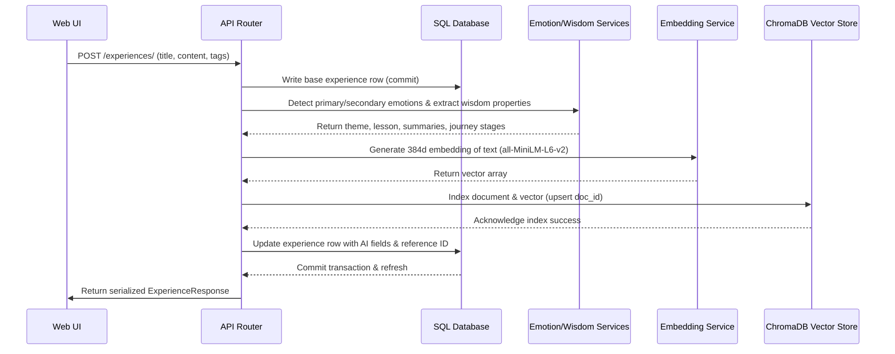
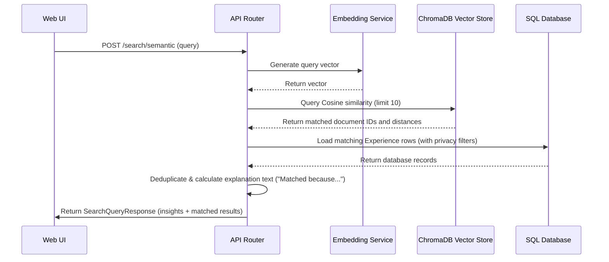
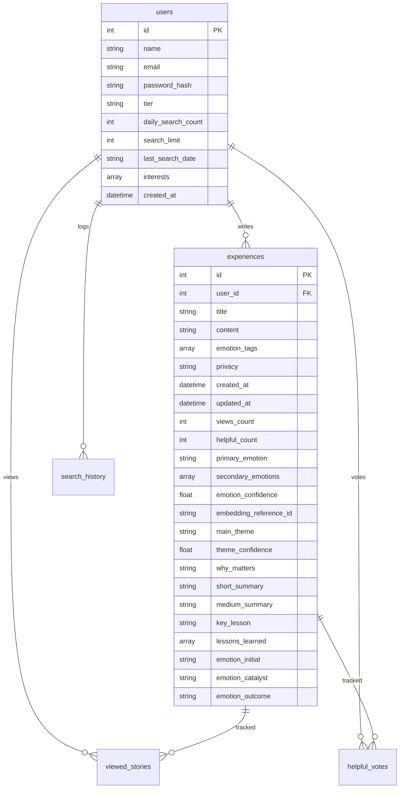

# System Architecture

This document details the multi-tiered system design of Veilory, outlining boundaries, data flows, and structural relationships.

---

## 1. High-Level Component Boundaries

---

## 2. Request & Execution Lifecycles

### 2.1 Story Creation & Indexing Flow
When a user submits a story, it is stored in the relational database, processed through the local NLP extractors, vectorized, and indexed in ChromaDB.

### 2.2 Semantic Search Flow
When a user inputs a search query, it is embedded, queried against ChromaDB, matched, deduplicated, and enriched with explanations before returning to the user.

---

## 3. Database Schema Layout

The relational database schema is structured around five core tables:
* **users**: Stores authentication credentials, tier details (`free` or `premium`), interests array, and daily search limits.
* **experiences**: Stores user-submitted stories with primary/secondary emotions, theme, why it matters, lessons, summaries, and journey stages.
* **search_history**: Logs user queries for analytics and search limits tracking.
* **viewed_stories**: Logs reading history to train the recommendation engine.
* **helpful_votes**: Tracks helpful counts on stories.

